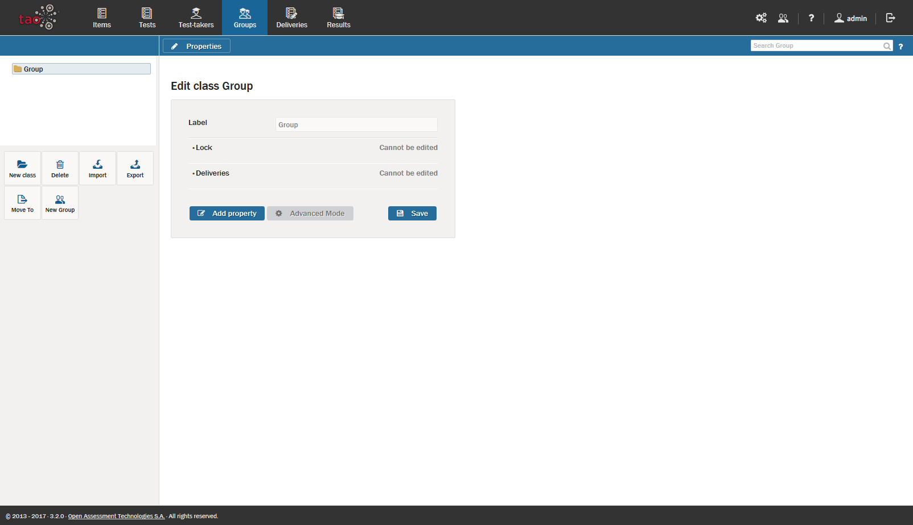

<!--
created_at: 2016-12-15
authors:         
    - "Catherine Pease"
--> 

# Groups: An Overview

>[Groups](../appendix/glossary.md#group) are organized collections of [Test-takers](../appendix/glossary.md#test-taker) who take the same [Tests](../appendix/glossary.md#test) (or assessments) throughout the duration of a course of study.

This section provides an overview of how to manage your groups of test-takers, including what you need to do to create groups, add new test-takers to groups, and how to re-use the same groups in different locations. 

**1.** Creating a new group.

Since a group is made up of individual test-takers, it is necessary to create a profile for each test-taker (see the section on [Creating a Test-taker](../test-takers/creating-test-taker.md)) prior to assigning test-takers to groups. Once this has been completed, groups of test-takers can be created. See [Creating a new Group](../groups/creating-a-new-group.md) for information on how to do this. 

**2.** Extending a group.

The section [Creating a new Group](../groups/creating-a-new-group.md) also contains information on how to add test-takers to existing groups.

**3.** Importing and exporting groups

Groups of test-takers can be imported to and exported from different storage devices, to enable them to be used in different test scenarios. For more information on how to do this, see [Importing Groups](../groups/importing-groups.md) and [Exporting Groups](../groups/exporting-groups.md).