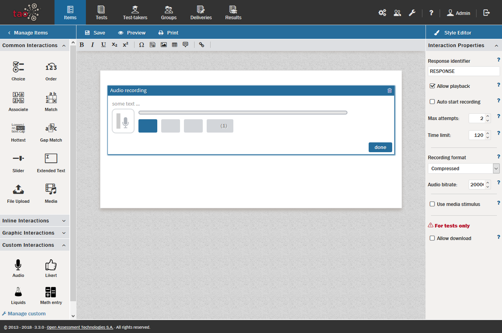
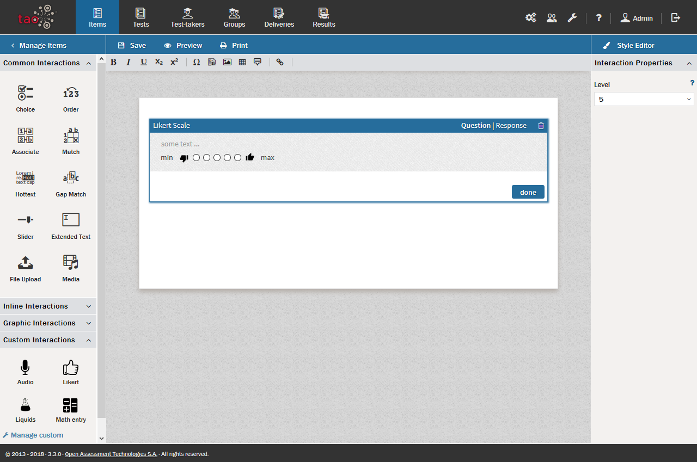
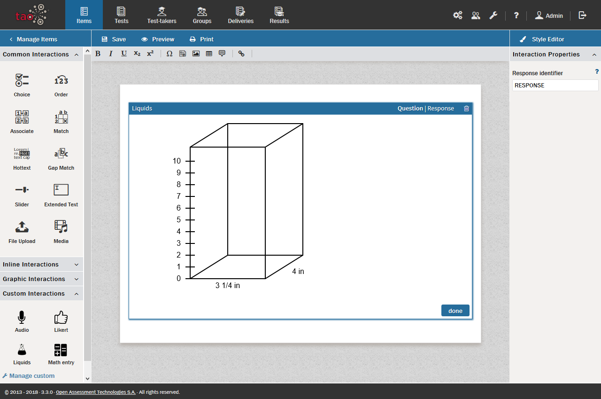
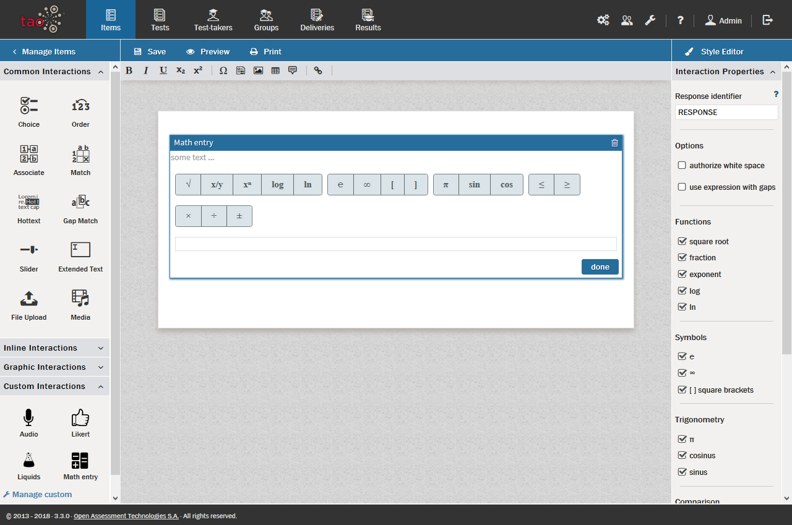
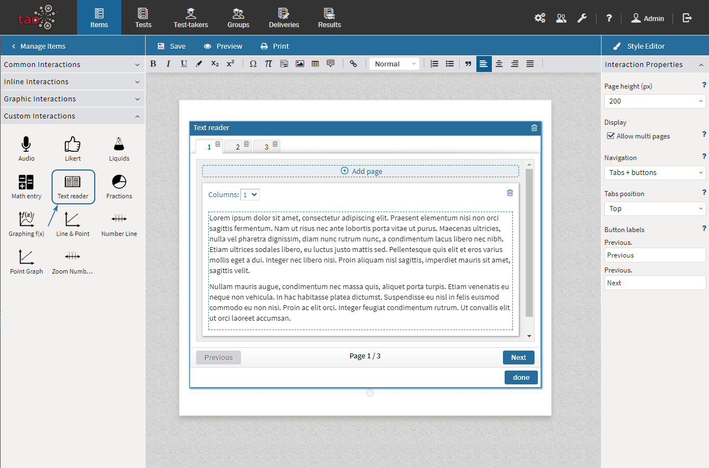

# Portable Custom Interactions

>Portable Custom Interactions (PCIs) are [Interactions](../appendix/glossary.md#interaction) which are developed for a specific scenario, generally to fulfill a particular need of a customer, hence are not classical QTI interactions. PCIs represent a best practice for defining and packaging custom interactions. Unlike classical [Custom Interactions](../appendix/glossary.md#custom-interaction), they interact with the test runner (standardized APIs), allowing them to be ported from one system to another.

The following types of PCI are part of the standard TAO package: *Audio, Likert, Liquid, Text Reader*, and *Math Entry*.
 

- **Audio**: An *Audio* interaction enables the [Test-taker](../appendix/glossary.md#test-taker) to record a short spoken response, typically to test his/her speaking ability. The test-taker is presented with an image of a tape recorder, and can record speech by clicking on the record button, and check the recording using the play-back button. The response format is an audio file. Audio interactions are only compatible with *Firefox* and *Chrome*, not with *Internet Explorer* or *Edge*. *Chrome* requires a connection via *https*, whereas at the present time *Firefox* allows both *https* and *http* connections (this is, however, expected to change to only *https* in the future).

- **Likert**: In a *Likert* interaction, a scale from 1-5 is used to represent people's attitudes to a topic. This is commonly used in qualitative surveys. The scale is presented using 'thumbs-down' and 'thumbs-up' images to represent a negative or positive response, and offers five buttons from which to select a choice. The response is a simple integer representing the selected choice. Likert interactions are not usually scored, as there is no right or wrong.

- **Liquid**: A *Liquid* interaction, developed to showcase the possibilities of PCIs, contains a simple simulation of a liquid container. The container has a scale on the left-hand side. This type of interaction can be used to ask questions about volume. To record the correct answer, click on *Response* and then click inside the cube at the desired point. If the answer is "5 liters", for example, click in the cube at the level of the 5 on the scale on the left-hand side, and the cube will 'fill' to that level with a simulated blue liquid.

- **Math Entry**: A *Math Entry* Interaction employs a Math Editor, which allows for the use of mathematical symbols in the interaction. The editor provides a list of mathematical symbols and an empty text field. Please note that the editor only provides the possibility of drawing mathematical symbols, but does not carry out any calculation. See the [Math Expressions section](../items/math-expressions.md) for more information on how to use the Math Editor.

- **Text Reader**: With a *Text Reader* Interaction it is possible to reproduce the idea of asking a test-taker to look for information in a book. This interaction provides a space in which to enter the text you would like the test-taker to read. It can be a complex text which includes images or mathematical symbols. It can consist of multiple pages, and each page can contain multiple columns. You may want to adjust the page height if you have a long text: this can be done in Properties Panel on the right. A scrollbar is supplied in the case of longer texts. You can also disable the multiple page option in the properties panel so that only one page appears on the screen at any one time. In this case, the test-taker can navigate through the text using the *Previous* and *Next* buttons which appear below the text. These can be displayed in different languages, defined also in the properties panel. [Tooltips](../appendix/glossary.md#tooltip) can be added by clicking on the speech bubble on the gray toolbar when editing the text and entering a hint for the test-taker. It is typically combined with a set of questions, such as multiple choice questions (to do this, add a Choice interaction). 

 

*Note: The PCI interactions shown in the image above, other than the five described in this chapter, are available in the Premium/Ignite Edition of TAO (or higher).*  

To create any of these types of interaction, once you have created a new Item, click on the [Custom Interactions library](../appendix/glossary.md#custom-interactions-library) below *Graphic Interactions* on the left, and drag the appropriate interaction type onto the blank Item, drop it onto the [canvas](../appendix/glossary.md#canvas), and then populate the Item.
