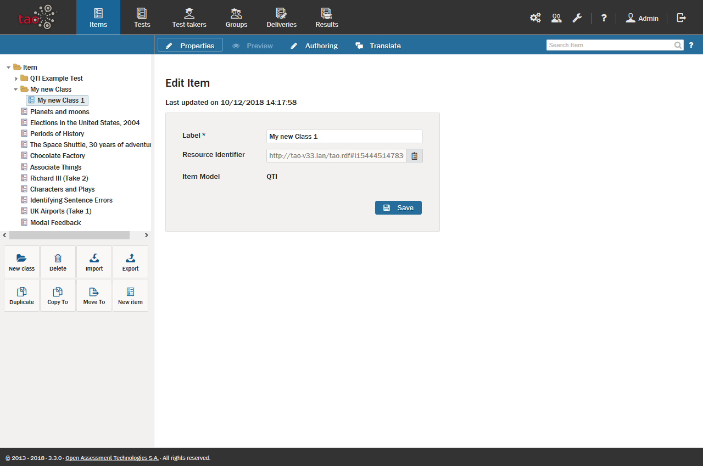

<!--
created_at: 2018-10-22
authors:         
    - "Catherine Pease"
--> 

# Item Authoring Workflow

>A newly created [Item](../appendix/glossary.md#item) starts life as a *draft*, and must be submitted to a review process before it can be used in a [Test](../appendix/glossary.md#test).

There are different stages in the review process, and the *State* (or status) of an item shows the current stage of the item in question in this process.  

The item in the image above has just been created, and therefore has the status (*State*) of being a draft.

To review an item, the following steps must be carried out:

**1.** Submitting an item for review.

The [Item Author](../appendix/glossary.md#item-author) is responsible for submitting each new item for review. 

As item author, click on the Items icon in the [Assessment Builder Bar](../appendix/glossary.md#assessment-builder-bar). This will take you to the Items page. The [Library](../appendix/glossary.md#library) on the left-hand side will show existing items.

Next, bring up the item you wish to submit for review by selecting it from the library. It will appear on the canvas, along with its properties. When a new item is created, it is automatically assigned *draft* status. 

If you are happy with the new item, select *Submit item for review*. If not, you can either make further changes to it, or choose *Abandon item*.

Submitting the item for review changes its status to *Ready for review*. Selecting to abandon the item means that it will be marked as *Abandoned*.

**2.** Reviewing an item.

It is the responsibility of the [Tenant Administrator](../appendix/glossary.md#tenant-administrator) to review items marked *Ready for review*.

As the tenant administrator, you can start the review by clicking on *Start item review* in the gray box below the status description.

The *State* will change to *In Review*.

When an item is *In Review*, three options will appear: *Accept Item*; *Item revision required*, and *Reject Item*.

If you decide that the item has passed the review, select *Accept Item*. Its *State* will change to *Final*. The item can now be used in a test.

If you decide that the item requires further revision, it will be returned to the item author, who will need to make the necessary modifications. In this case, its *State* changes to *Revision required*. 

If you choose to reject the item, its state is changed to *Rejected*.

**3.** Revising an item.

After revising the item as item author, you can choose to *Resubmit item for review* if you are happy with the revisions you have made, or to *Abandon item*. 

Clicking on *Resubmit item for review* will take the *State* back to *Ready for Review*, and the whole review process begins again. Abandoning the item means that its status will change to *Abandoned*.

**6.** Retiring an item.

A tenant administrator can also decide to *retire* an item. If this is the case, the status of the item is changed to *retired*, which indicates that the item is no longer in use.

*Note: The status of an item has no binding implications for its use in tests. Items should, however, be filtered by status during test assembly to ensure that only those which have passed the review process are inserted in tests.* 

See the section on [Creating a New Test](../tests/creating-a-new-test.md) for information on how to use successfully reviewed items in tests.

