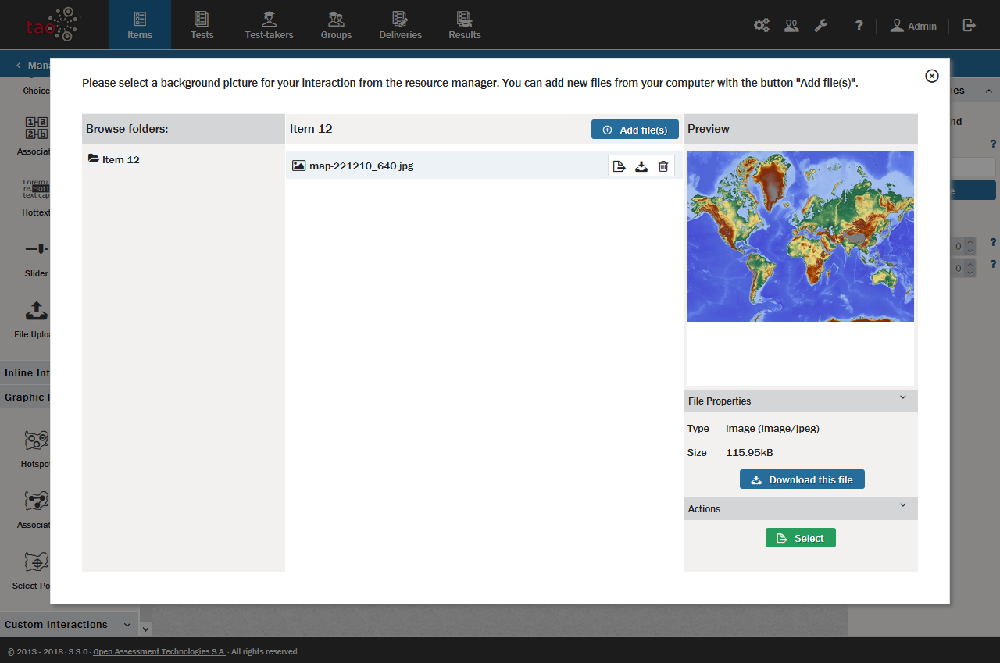

# Using Assets (or Media) in Items

> Items and interactions can contain Assets (media), e.g. images, videos, sound files or passages (previously called shared stimuli). These can be files which are stored in the [Asset Manager](../appendix/glossary.md#asset-manager), or files from your desktop. 

*Note: In some versions this is called the Media Manager (and the files are called 'Media' rather than 'Assets'), but they both function in the same way.*   

When you use a resource from the Asset (or Media) library in an item it isn’t integrated in your item, but instead is only referenced by it. This means that if the resource is updated, your item will automatically be modified to include the updated version of the resource. See the [Asset Manager](../asset-manager/asset-or-media-manager.md) section of the User Guide for further details.

Follow the steps below to use assets from the Asset library in your item.

**1.** When authoring a text block in your [Interaction](../appendix/glossary.md#interaction) or [Item](../appendix/glossary.md#item), a toolbar appears in the gray bar above the item containing a series of icons. 

Click on the floppy disc icon to include a file from the Asset Manager in your item.

This will take you to the Asset Manager. The middle panel shows the list of assets which are available within the highlighted [Class](../appendix/glossary.md#class) (i.e. folder) in the Asset library. Browse the assets available and choose one to include in your item.

**2.** Click the green *Select* button.

This uploads the asset you have chosen into the text block. If you begin typing without hitting return, the text will center vertically. If your text extends beyond the first line, however, it will wrap underneath the image (or other media). If the image is followed by a longer text, it is best to click on return on your keyboard at least once before starting to type.

*Note: To include a media file from your desktop in your item, select the relevant icon in the toolbar (the landscape for an image, or the music tape for an audio file), and click on *Add file(s)*, then the blue *Browse* button to browse your computer. Most image and audio formats are supported. When you save your item, the media file becomes an integral part of the item, and is not in the Asset library. To upload a new file to the Asset library, see the chapter on the [Asset Manager](../asset-manager/asset-or-media-manager.md) for further details, or to create a new 'Passage' to add to the Asset library, see the chapter on the [Passage Editor](../asset-manager/passage-editor.md).*   

