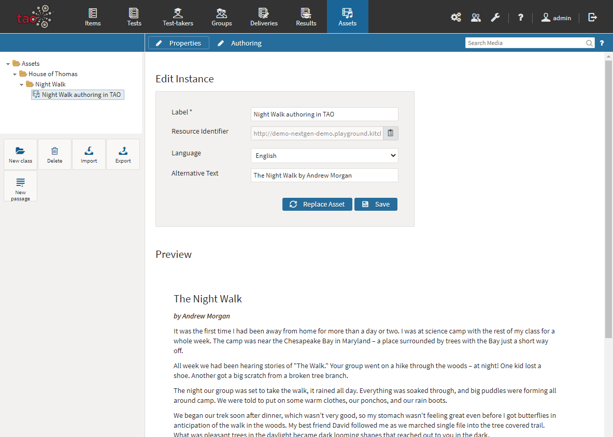

<!--
created_at: 2020-09-22
authors:         
    - "Catherine Pease"
--> 

# Asset Manager

> The Asset Manager provides a space to store assets (media), i.e. images, audio and video and (text) passages. This is a universally shared folder, which means you don't need to keep uploading the same files for use in different items. The Assets folder will always appear as an option for choosing input when you are populating items.

*Note: In some versions this is called the Media Manager (and the files stored in it are called 'Media' rather than 'Assets'), but they both function in the same way.* 

The Asset (or Media) Manager now offers a more efficient method of managing [Assets](../appendix/glossary.md#asset). Previously, when you saved your item, the resource you had inserted in your item became an integral part of it. 

Now, when you use a resource from the Asset (or Media) library, it isn’t integrated in your item, but instead is only referenced by it. When an asset is referenced (rather than integrated) in an item, the physical location of the asset is in the Asset Manager rather than in your item. The advantage of this is that there is only one version of it, so if it is updated, for example, all items which reference that particular resource will automatically also be updated.

You will find the same buttons in the Asset Manager as in most other functions under the library on the left (*New class*, *Delete*, *Import*, *Export*). The New class, Delete, and Export buttons work in a very similar way to most of the other functions. For more information on any of these, click on the following links: [New class](../appendix/glossary.md#class), [Delete](../appendix/glossary.md#delete), [Export](../appendix/glossary.md#export).

The *Import* button works in a slightly different way in the Asset Manager. Follow the steps below to import a new asset.

**1.**  Click on the _Assets_ icon in the *[Assessment Builder Bar](../appendix/glossary.md#assessment-builder-bar)*. The Asset library will appear on the left. Select the folder in the library where you want the new asset to reside.

**2.** Click on the *Import* button in the button bank under the library. This will bring up a dialog box in the center of the screen. 

**3.** Choose the input format. You have two choices - a file or a passage. A *file* can be in any picture, audio or video format (.jpg or .mp3, etc.) A *passage* - previously known as a shared stimulus - is an .xml file which contains a simple or complex text (a text with integrated images). See the [Passage Editor](../asset-manager/passage-editor.md) chapter in the User Guide for information on how to create and edit *Passages*. 

**4.** When you have chosen the input format, you can either select *Browse* to browse the files your computer, or you can drag and drop the file into the space provided. 

**5.** When the file has uploaded, click on *Import*.

Once the file has been imported, you will see the message *Asset imported successfully*. The new file will appear in the library on the left, in the Asset folder. 

**6.**  Click on *Continue*.

A dialog box labeled _Edit instance_ will appear, with the details of the new asset. This contains the following information:

- *Label* (the name of your imported file)
- *Alternative Text* (rename the asset here if you wish)
- *Language* (the default language is English, but you can change the language of the asset if appropriate)

If you want to replace the file with another, click on *Upload new asset*. Click *Save* to save the changes, including alternative text.

For information on how to use your assets in new items, see [Using Assets in Items](../items/using-assets-in-items.md). To create a new *Passage* to add to the Asset library, see the chapter on the [Passage Editor](../asset-manager/passage-editor.md).