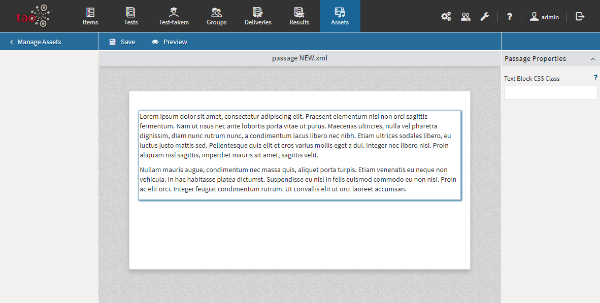

<!--
created_at: 2020-09-22
authors:         
    - "Catherine Pease"
--> 
## Creating and editing passages with the Passage Editor

> Passages in TAO are blocks of content, typically text passages. They are intended for use in reading assessments, though they may contain illustrations.
> 
> Passages are created using the [Passage Editor](../appendix/glossary.md#passage-editor). They are stored in the [Asset Manager](../appendix/glossary.md#asset-manager), so they can be used in multiple [Items](../appendix/glossary.md#item). 
> 
> Passages are .xml files which contain a simple or complex text (a text with integrated images). 

*Note: The passage editor is only available in the Premium/Ignite Edition of TAO (or higher).* 

###Creating a new Passage 

To author a new passage to add to the Asset library, follow the steps below.

**1.** Click on the _Assets_ icon in the *[Assessment Builder Bar](../appendix/glossary.md#assessment-builder-bar)*. 

The Asset library will appear on the left. Select the folder in the library where you want the new passage to reside.

**2.** Click on *New passage* under the library.

The new *passage* will appear on the canvas. Rename the label as needed. 

**3.** Click on _Authoring_ in the Action Bar to enter the Passage Editor.

Add your text to the blank canvas.

To integrate an image into the passage, use the icons situated above the canvas. This can be a file already available in the Asset library, or something from your desktop. It will appear on the screen. If you are happy with your choice, click on the green *Select* button at the bottom. This inserts the image into the passage.

**4.** Click on _Preview_ in the action bar to see what the final passage will look like.

**5.** Once you have finished editing, save the passage and return to the Asset Manager.

###Editing an existing Passage

You may want to edit an existing passage, in order to replace it with an updated version. In this case, after Step One above, select the passage from the library, then jump to Step Three. From here on the steps are the same for both procedures.

*Note: Remember that editing a passage will have an impact on every item that includes it.*

For information on how to use your assets in new items, see [Using Assets in Items](../items/using-assets-in-items.md).