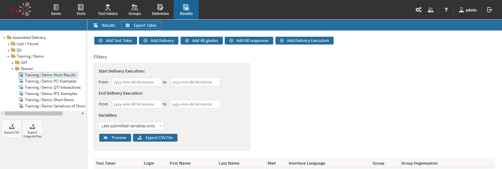

# Exporting Results

> [Results Tables](../appendix/glossary.md#results-table) may be set up on almost any computer that has access to TAO. However, there will be situations in which posting [Results](../appendix/glossary.md#results) on another system will be useful. Transferring results tables to another device can be carried out in a few easy steps.

**1.**  Click on the Results icon  in the [Assessment Builder Bar](../appendix/glossary.md#assessment-builder-bar).

This will show the last results table which you, or the user before you, opened. On the left-hand side of your screen you will see the [Library](../appendix/glossary.md#library) of existing results for specific [Deliveries](../appendix/glossary.md#delivery).

**2.** Click on the desired delivery in the library. 

This will bring up the [Test](../appendix/glossary.md#test) results (the results table) associated with the given delivery. Typically, this should be done only after the submission deadline has passed, so that all the Results can be compiled in one table.

*Note: You can view the results by clicking on the blue View button to the right of a particular [Test-taker](../appendix/glossary.md#test-taker). For more information on the way the results are presented, see [Viewing Results](../results/viewing-results.md).*

**3.** Click on the blue button marked *Export Table* on the [Action Bar](../appendix/glossary.md#action-bar) at the top of the results table.

There are five buttons which you can toggle between, depending on the information you wish to include in the file to be exported.

*Add Test Taker*/*Anonymise*: This controls the display of test-takers' names associated with the results table (*Anonymise* appears here in red, as the names are added by default; by clicking on *Anonymise* the names will be taken out).

*Add Delivery/Remove Delivery*: This controls the display of information about the delivery, including, for example, its title and requirements, and the dates it was available. (This is blue, so by default this information is not included; by clicking on *Add Delivery* it will be added).

*Add All Grades*/*Remove All Grades*: This controls the display of scores associated with the results table (This is blue, so by default the scores are not included; by clicking on *Add All Grades* they will be added).

*Add All Responses*/*Remove All Responses*: This controls the display of responses associated with the results table (This is blue, so by default the responses are not included; by clicking on *Add All Responses* they will be added). 

*Add Delivery Execution/Remove Delivery Execution*: This controls the information on the dates on which the delivery was executed (i.e. the dates the delivery session took place), and shows when a particular test-taker started the test and when he finished it. (This is blue, so by default the delivery execution dates are not included; by clicking on *Add Delivery Execution* they will be added).

Using the *Filters* below these buttons, you can specify the results you would like to export according to when the tests were delivered. To do this, enter the desired start and end dates for the particular assessment period in question. You can also specify just a start date, which means that the results of all tests delivered since that date will be exported. 

In the *Variables* drop-down menu you can choose which information to export for the results you have chosen. These variables relate to the information you selected using the toggle buttons above (i.e. the variables relating to test-takers' names, scores and responses and the delivery). To display your current selection, click on *Preview* . If you have chosen above to anonymise the test-takers, for example, their names will not appear in the results displayed. If you wish to export the results table in this form, select *Last submitted variable only* in the drop-down menu. You may wish to display all the variables on your screen (*All collected variables*), and then select a subset of the data to be exported using the filter.

**4.** Click the *Export CSV File* button below the results table.

This creates a *character separated value* file formatted for Microsoft Excel which can be translated into score information. Once the button is clicked, a window appears asking where you would like to save the file.

**5.** Select the location to which to export your results, and then *Save*.

The results table, easily opened in Excel, can then be transferred either to a data storage device or a computer network.

**6.** Exporting the results for an entire delivery.

It is possible to export the results for a whole delivery, or more than one delivery - in other words, the entire tree structure of results for that delivery. To do this, click on the [Class](../appendix/glossary.md#class) (i.e. folder) in the results library for the delivery you wish to export.

Next, click on the *Export CSV* icon in the button bank under the library. If the background tasks functionality is installed on your version of TAO, the export process will be transferred to it (shown in a circle to the left of the [Properties](../appendix/glossary.md#properties) icon on the assessment builder bar). Clicking on the circle opens the list of tasks, containing information about each one. Click on the *download* icon to the right of your results export to download the CSV file to your computer. 

If the background tasks functionality isn't installed in your TAO environment, the download will begin as soon as you select *Export CSV*, and will appear in the downloads area of your computer.  

