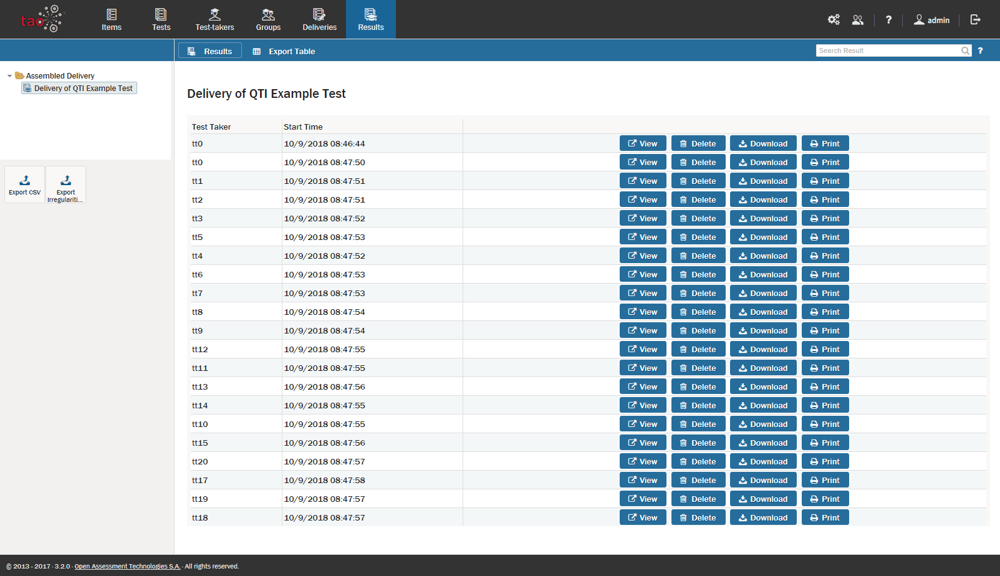

# Viewing Results

> The [Results](../appendix/glossary.md#results) of a [Test](../appendix/glossary.md#test) are collected for each [Delivery](../appendix/glossary.md#delivery), and can be viewed under the Results icon.

**1.**  Click on the Results icon  in the [Assessment Builder Bar](../appendix/glossary.md#assessment-builder-bar).

This will show the last [Results Table](../appendix/glossary.md#results-table) which you, or the user before you, opened. On the left-hand side of your screen you will see the [Library](../appendix/glossary.md#library) of existing results for different deliveries.

**2.** Click on the desired delivery in the library. 

This will bring up the test results (the Results Table) associated with the given delivery. Typically, this should be done only after the submission deadline has passed, so that all the results can be compiled in one table.

**3.** Click *View* on the right of the [Test-taker](../appendix/glossary.md#test-taker) whose results you want to see. 

A results table will appear. The first table is entitled *Test taker*, and contains the information of the student who took the test, e.g. name, login, email.

On the right of this table there is a filtering drop-down menu, and a blue *Filter* button.

Below the *Test Taker* table is the *Test Variables* table. Below exit codes (the *exit code* information can be ignored), you will see the “LtiOutcome” variable and its corresponding numbers. This reflects the total test score for the test-taker in question. If all of the questions were answered correctly, this will be "1". If some of them were incorrect, it will be below 1.

Below the *Test Variables* table is a detailed analysis of the [Items](../appendix/glossary.md#item) in the test. This *item* table is divided into three parts: Responses, Grades, and Traces.

*Responses*: includes information on the answer chosen by the test-taker.

*Grades*: includes information on the score given, and whether the item was completed (or skipped).
 
*Traces*: records the start and end times for the test, as well as the time zone.

As mentioned above, these three outputs can be filtered out.

If you would like to see any of the test items pertaining to the results you are viewing, you can click on the *Review* button next to the relevant item. The assessment question will then be shown. Click on the blue *close* button in the right-hand corner of the screen to return to the results.
 
