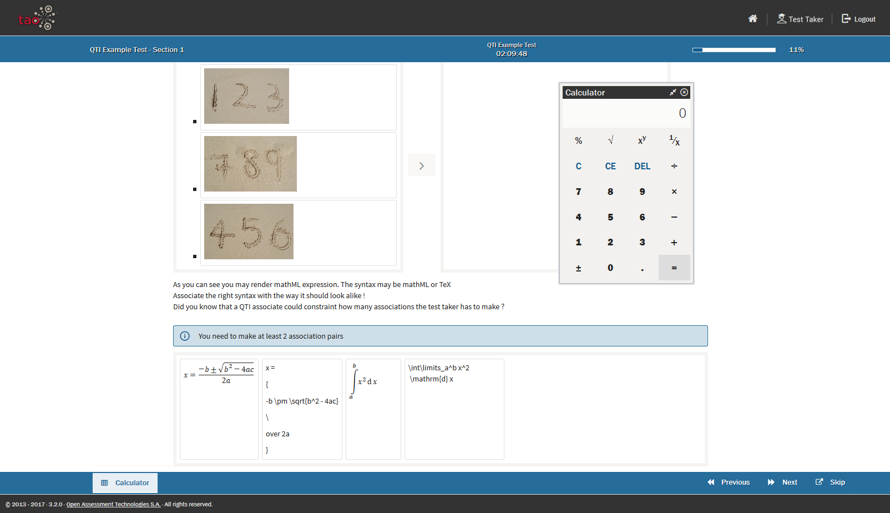
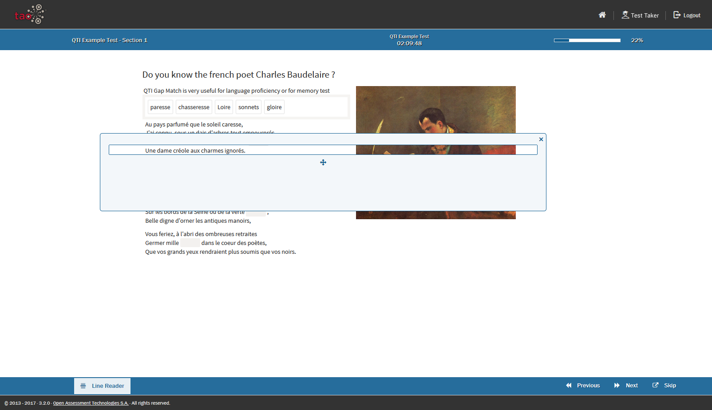
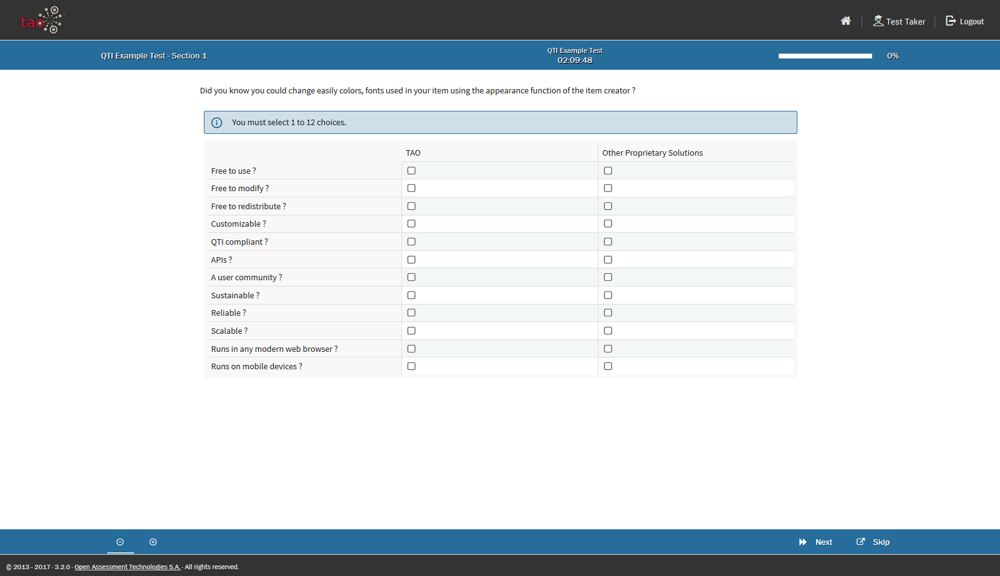

<!--
created_at: 2018-10-22
authors:         
    - "Catherine Pease"
--> 

# Accessibility Tools

> The [Accessibility Tools](../appendix/glossary.md#test-taker-tools) are a set of accommodation tools which are designed to aid the [Test-taker](../appendix/glossary.md#test-taker) in various ways when taking tests. 

The Accessibility Tools which have been activated for a [Test](../appendix/glossary.md#test) can be found in the [Properties Panel](../appendix/glossary.md#properties-panel) on the right.

*Note: Accessibility tools can be activated either for a whole [Section](../appendix/glossary.md#section) of a test, or for each [Item](../appendix/glossary.md#item). Not all Accessibility Tools are activated for every test - this depends on the test configuration.*

The tools available are as follows:
 
## Calculator
This option provides the test-taker with a basic calculator.

 
## Answer Eliminator
The Answer Eliminator allows the test-taker to eliminate answers in *Choice* interactions. This is useful if there is a long list of answer choices, and the test-taker has a learning disability.

## Answer Masking
Answer Masking allows the test-taker to mask and unmask answers in choice interactions.

 
## Area Masking
Area Masking allows the test-taker to mask parts of the item with a movable mask.

## Flag
Flagging an answer to a particular question allows the test-taker to review the answer at a later stage. Flagged items are marked in the review panel on the left. The test-taker can return to flagged items by clicking on the flag in the review panel.
<!-- Missing Screenshot: Flagging an item for Review -->

## Highlighter
The Highlighter allows the test-taker to highlight parts of the text in an item.

## Line Reader
The Line Reader allows the test-taker to visually isolate a line of text.

## Magnifier
The Magnifier provides the test-taker with a movable magnifier tool.

## Zoom Tool
The Zoom Tool allows the test-taker to zoom in on an area of an item.

## Text-to-speech
The text-to-speech functionality allows the test-taker to hear the questions of a test being read aloud. *Note: This functionality is only available on the Premium Edition of TAO.*

A list of keyboard shortcuts for these tools can be found in the section [Keyboard Shortcuts](../taking-a-test/keyboard-shortcuts.md).
