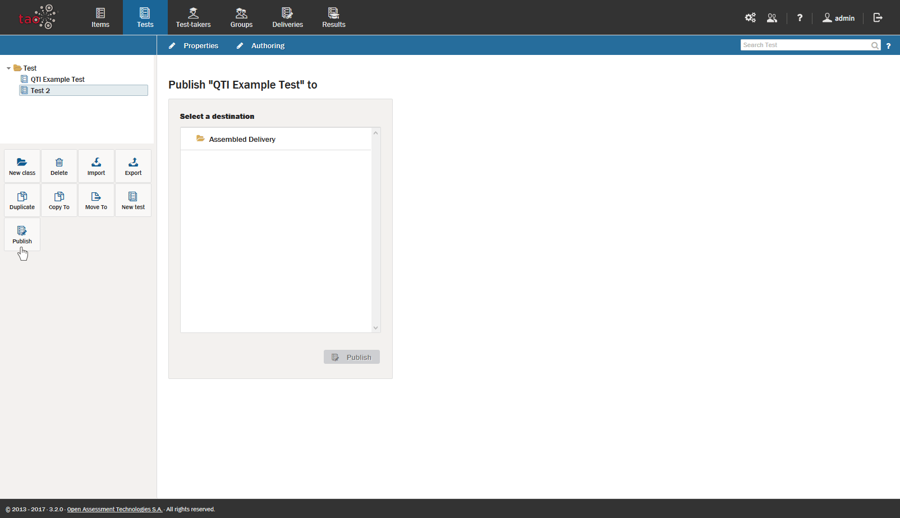

# Publishing a test

>Publishing a test means creating a [Delivery](../appendix/glossary.md#delivery) for an assessment.

In TAO there are two ways of creating a delivery: you can either follow the instructions described in the section on [Deliveries](../deliveries/create-a-new-delivery.md), or you can publish a test directly from within the Test manager. The steps below show you how to publish the test directly.  

**1.**  Click on the *Publish*  icon in the button bank under the library.

This will show the dialog below:

**2.**  Select the directory in which you want to create the delivery and click on *Publish* at the bottom of the dialog. Remember that the library in this dialog refers to your deliveries and not your tests!

To configure the delivery you will still need to proceed as decribed in the section on [Deliveries](../deliveries/create-a-new-delivery.md).