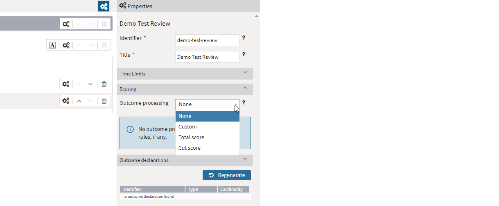
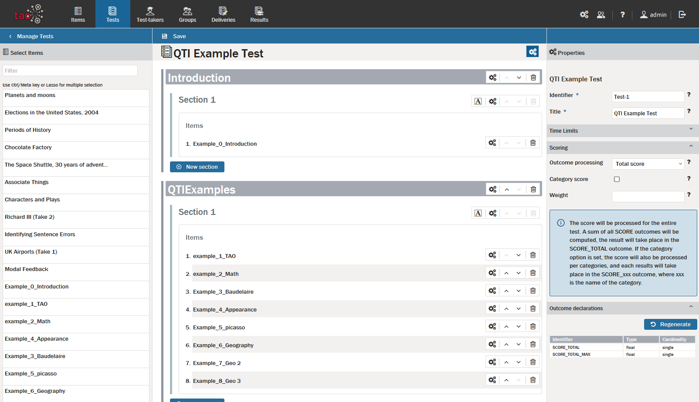
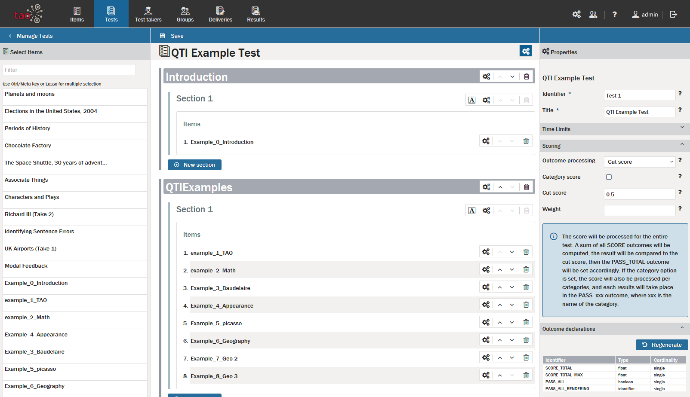

<!--
tags: []

--> 

# Test Scoring Rules and Outcome Declarations

> Test scores are determined by a student's performance in the various [Items](../appendix/glossary.md#item) of a [Test](../appendix/glossary.md#test). Individual item scores can be tallied using different methods to produce the final test result. This chapter shows how to configure the test scoring rules, and compute the Outcome Declarations (i.e. define the scoring criteria).

>In previous versions of TAO, it was only possible to process one interaction at a time when evaluating the test-taker responses of a test. In 3.4, it is now possible to take multiple interactions into consideration. You may want to specify, for example, that if the test-taker completes interaction A or interaction B correctly - but not both - they are awarded half the score.

>For information on the scoring rules used for items, see [Item Scoring Rules](../items/item-scoring-rules.md).

Follow the steps below to set up your chosen scoring method.

**1.** After you have created your test by selecting the items which are to go in it, hover over the cog wheels just below the [Action Bar](../appendix/glossary.md#action-bar), at the top of the right-hand corner of the [Canvas](../appendix/glossary.md#canvas), and you will see the option *Manage Test Properties*. Click on this and the general properties of the test will be displayed in the right-hand panel, including the properties for scoring.

**2.** Click on the button *Scoring*.

There are four methods for scoring a test, or "outcome processing" as this is called in QTI. Enter your choice from the four options below in *Outcome Processing*:

- **None**: If this option is selected, any existing scoring rules will be removed. In this case, no test score will be generated. Scores for the individual items of the test can be extracted by clicking on *Results*, or the QTI Results API. Use this option if you do not need aggregated test scores, or want to do custom outcomes processing outside of TAO.

- **Custom**: This option is the one to use if you want multiple interactions to be taken into consideration when generating a score. The processing rules for this need to be defined outside of TAO. A screen ‘Edit processing rule’ will come up when you select ‘custom’. Here, select your (external) scoring rule which states how you would like the test taker responses to the item to be processed.

- **Total Score**. If you select this as your chosen method, all scores from all parts of the test will be added together, and outcome variables for the test-taker's score (SCORE\_TOTAL), the maximum score of all items (SCORE\_TOTAL\_MAX) and the ratio of correct responses (SCORE\_RATIO) will be generated.
 

- **Cut Score**: If you choose this option, a cut-off point for passing the test will be fixed. Enter the score which is to be used as the cut-off point in the *Cut Score* box. This is set as a ratio of the total score. A PASS variable is then generated, indicating if the student has passed the test. When "Category Score" is active (see below), PASS variables for all categories are generated, all using the same cut-off point. 

If you choose either of the latter methods (*Total Score* or *Cut Score*), some additional information is required.

A check-box for *Category Score* will appear. If *Category Score* is selected, the scores will be calculated for each category separately. You will also need to set the *Weight* variable in the *Weight* box, which is used to calculate the score, and is by default 'WEIGHT'. Different *weights* can be assigned to different items of the test, based on how much they should contribute to the final test score. For example, if a weight of 2 is entered, the score for that item is multiplied by 2 when calculating the final test score (see section Item Scoring Rules for more information on weighting). If, for any item of the test, there is no such weight definition at the Item level, the scoring engine assumes the default value = 1.

When item metadata is inserted, it is automatically transferred to the categories of the item. Categories can also be managed manually.

**3.** Click on the button *Outcome Declarations*. 

The Outcome Declarations are directly related to the scoring rules you have chosen above; the list of generated outcome variables is as follows:
 
- If you selected **None** as the outcome processing method, all outcome variables are removed

-  If you selected **Total score** as the outcome processing method, outcome variables are generated to calculate total scores

-  If you selected **Cut score**, as the outcome processing method, outcome variables are generated to calculate total scores and variables which are checked against the cut-score which has been defined (typically pass/fail)

- If a **WEIGHT** has been applied, additional outcome variables are generated to compute weighted scores

*Note: Outcomes are generated automatically, but in the few cases where this does not occur, the values can be generated using the 'regenerate' button.*  

The configuration of the scoring rules is now complete. 