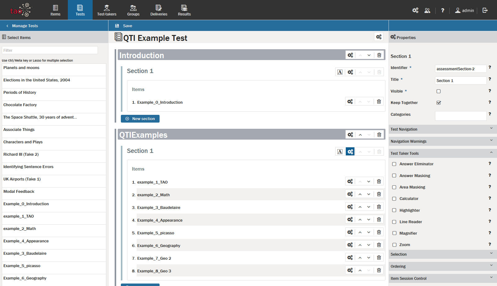
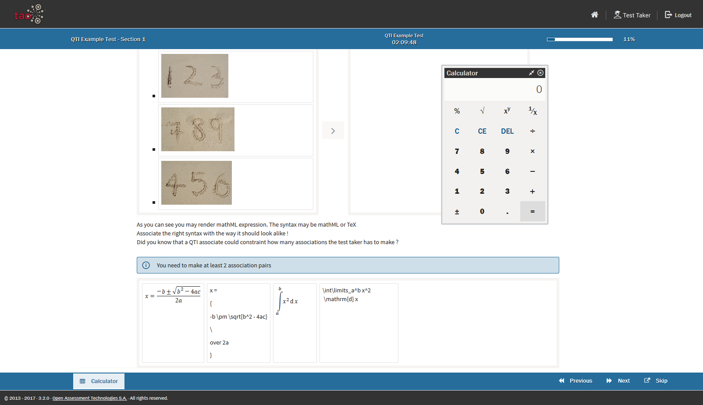
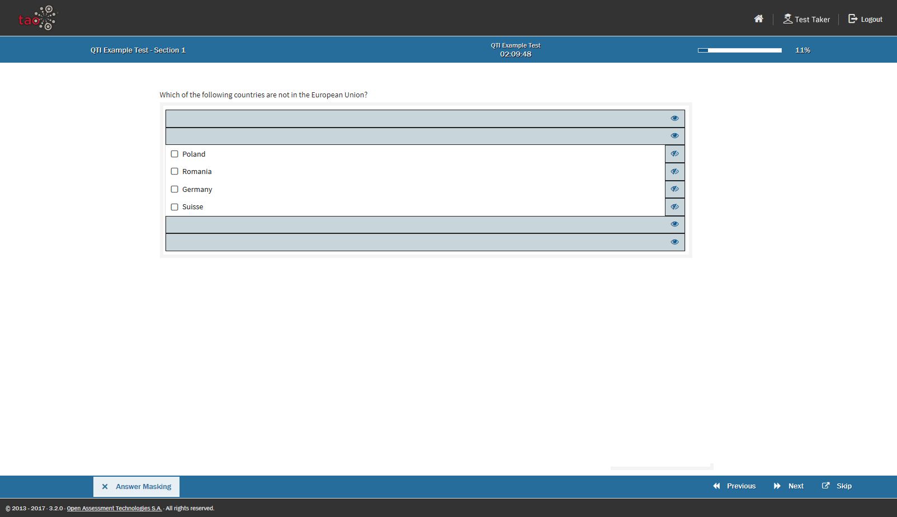
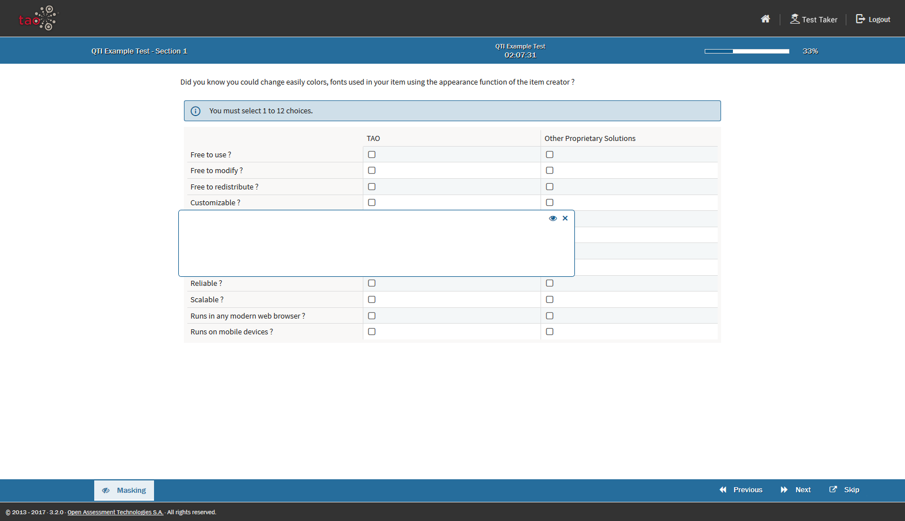
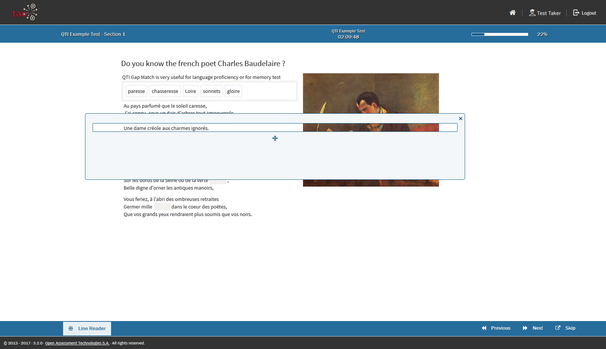
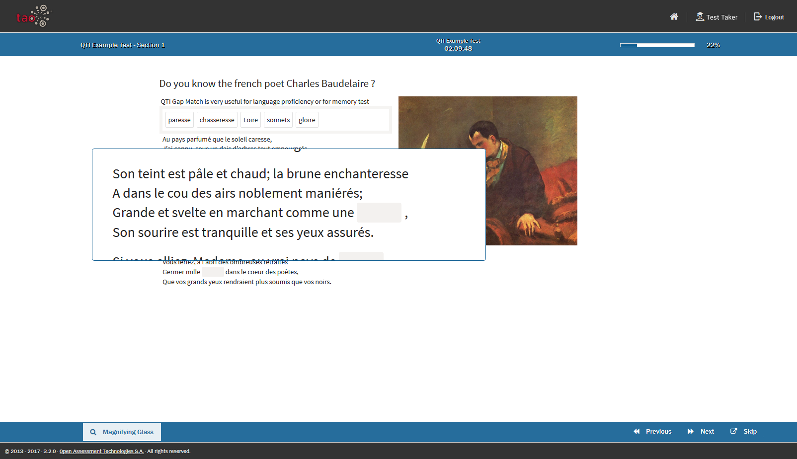
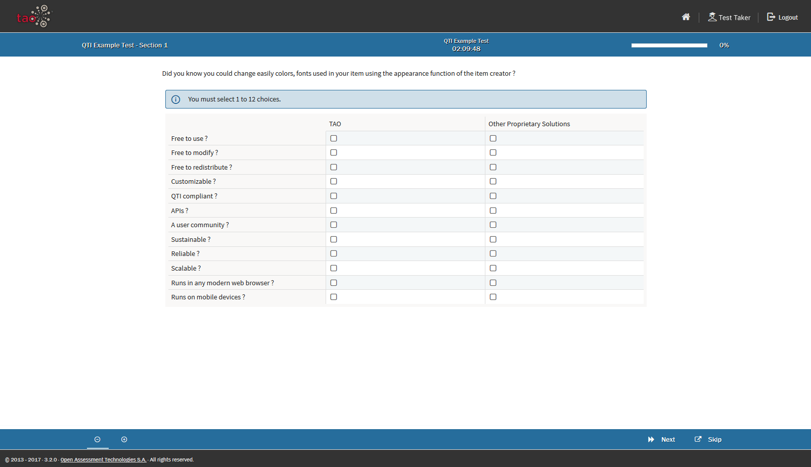
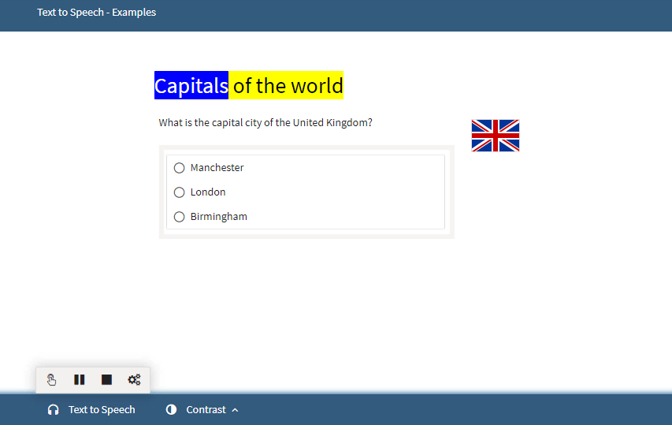

# Test-taker Tools

> The [Test-taker Tools](../appendix/glossary.md#test-taker-tools) comprise a set of tools designed to aid the [Test-taker](../appendix/glossary.md#test-taker) in various ways when taking [Tests](../appendix/glossary.md#test). Many of them are accommodation tools which aim to improve accessibility. The test-taker tools for a test can be found in the [Properties Panel](../appendix/glossary.md#properties-panel) on the right.

To configure the test-taker tools for a specific test, follow the steps below.

**1.** Select the test for which the test-taker tools are to be configured from the [Test Library](../appendix/glossary.md#test-library) on the left, and click on *Authoring*.

Test-taker tools can be configured either for a whole section of a test, or on a per-item basis. To configure the tools for a whole section, on the [Canvas](../appendix/glossary.md#canvas) click on the cog wheels to the right of the section in question. To configure the tools for an individual item, click on the cog wheels to the right of the item in question.

In each case, the test-taker tools will appear in the properties panel on the right.
 

**2.** Check the boxes next to each of the test-taker tools you wish to activate.

The Tools available are as follows:
 
## Calculators
TAO provides three different calculators, a simple one, a BODMAS and a scientific version. 

_Note: If you select multiple calculators, only the most complex variety will be used!_

 
## Answer Eliminator
The Answer Eliminator allows the test-taker to eliminate answers in *Choice* interactions. This is useful if there is a long list of answer choices, and the test-taker has a learning disability.

## Answer Masking
Answer Masking allows the test-taker to mask and unmask answers in choice interactions

 
## Area Masking
Area Masking allows the test-taker to mask parts of the item with a movable mask.

## Highlighter
The Highlighter allows the test-taker to highlight parts of the text in an item.

## Line Reader
The Line Reader allows the test-taker to visually isolate a line of text.

## Magnifier
The Magnifier provides the test-taker with a movable magnifier tool.

## Zoom Tool
The Zoom Tool allows the test-taker to zoom in on an area of an item.

## Text-to-speech
The text-to-speech functionality allows the test-taker to hear the test content being read aloud, as well as reading it.

*Note: This functionality is only available in the TAO Premium/Ignite Edition (or higher).*

## APIP Text-to-speech
The APIP (Accessible Portable Item Protocol) text-to-speech functionality is an alternative to the normal text-to-speech functionality. It works using pre-recorded files for each item in a test. When it is enabled, a *Play* button will appear on the right of the test item when the test-taker is sitting the test. 

*Note: The recordings used for this functionality need to be prepared outside of TAO and then imported, as TAO does not support the authoring of packages with APIP content. These can be in any format, but the format needs to be compatible with the browser used.*

       

Configuration is now complete. Any test-takers taking the test will have access to the selected tools, for the sections or items specified.

