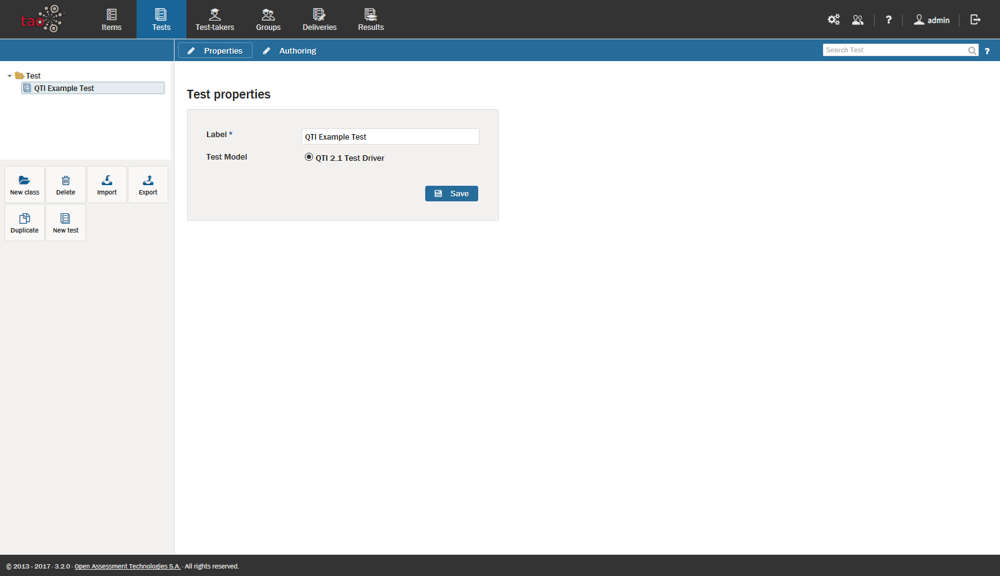

# Tests: An Overview

>[Tests](../appendix/glossary.md#test), or assessments, are assembled from individual [Items](../appendix/glossary.md#item). Items are built from [Interactions](../appendix/glossary.md#interaction), which are based on exercises such as multiple choice questions. Tests define the order of items, as well as how and when they are presented to the [Test-taker](../appendix/glossary.md#test-taker). For a full definition, see [What is a Test?](../tests/what-is-a-test.md).

This section provides an overview of how to manage your tests, including what you need to do to construct them, what the result looks like, the choices you need to make along the way, and what you can do with them once they have been created.

**1.** Creating a new test

A Test is a collection of items designed to assess the academic progress of a test-taker. To create a new test, items first need to be created (see [Creating a new Item](../items/creating-a-new-item.md)), so that they can be used in assessments. A new test can then be put together: see [Creating a new Test](../tests/creating-a-new-test.md) for information on how to do this.

**2.** Defining the settings for your new test

Once you have created a new test, you will need to assign certain properties to it, such as the length of the test. There are four levels in which properties may be assigned, from the top test level down to the individual item level. See [Test Settings](../tests/tests-settings.md) for information on how to assign these properties.

**3.** Importing and exporting your tests

You can import and export your tests to and from different storage devices in order to be able to use them in different locations. For more information on how to do this, see [Importing a Test](../tests/importing-a-test.md) and [Exporting a Test](../tests/exporting-a-test.md).
