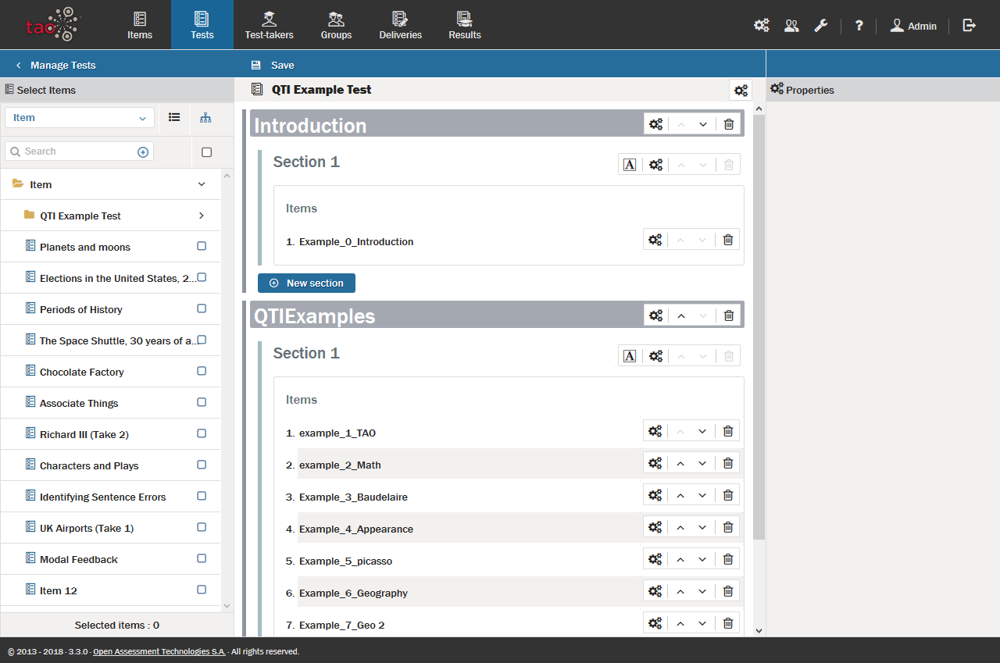

# What is a Test?

> [Tests](../appendix/glossary.md#test), or assessments, define the continuity between [Items](../items/what-is-an-item.md), how they are ordered, and how they are presented to the [Test-taker](../appendix/glossary.md#test-taker). They also define the constraints and settings, including those related to time and navigation policies. Tests may be built from building blocks called *Item Sections* that logically sort Items into groups, making configuring a Test easier.

In TAO, assessments are assembled from individual items that are later delivered to test-takers through an automated [Delivery](../deliveries/what-is-a-delivery.md) system. If there are enough items within a test, they can be sorted and grouped into item sections according to any logical set of criteria.

Tests should be given an appropriate title which helps test-takers to accurately identify the assessment if it appears in a list of other assessments which the test-taker must also take at the same time. 

Test designers must consider issues such as whether the test-taker will need to follow a linear path through a test  - where questions need to be answered in a specific order, with no option to revisit them later - or whether questions can be answered in any order and revisited if desired. Time limitations and feedback are also important elements in successful test design.
