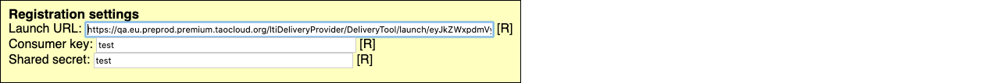
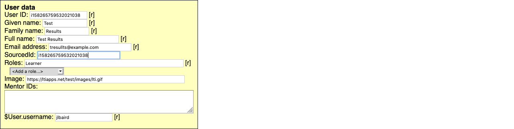
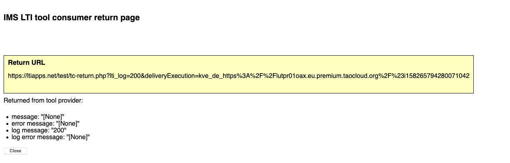
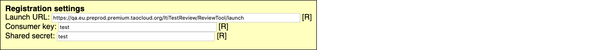
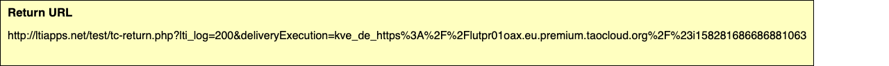
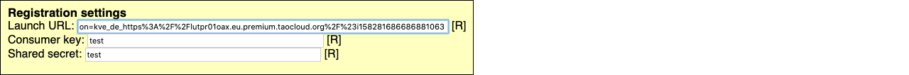
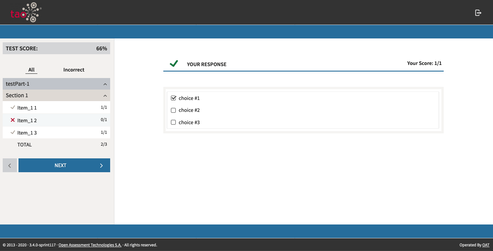
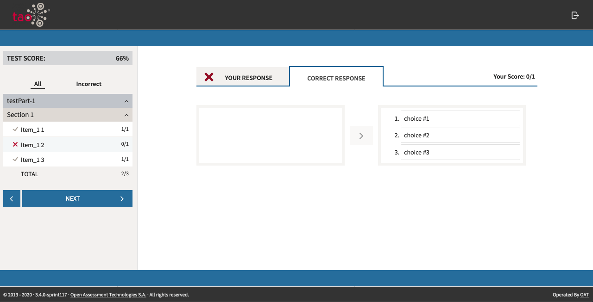
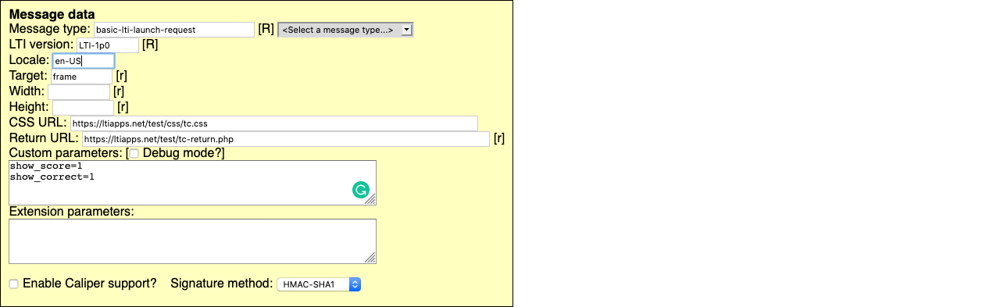

# LTI Test Review

> LTI Test Review allows test-takers to review their results with TAO utilizing LTI Consumers.

LTI Test Review utilizes a delivery that is delivered through an LTI Consumer. Follow the instructions on how to [Create an LTI Consumer with TAO Deliveries]({AG}/management/lti-consumers) if you do not have one configured already.

In this example, we will be using the [IMS LTI Tool Consumer emulator](http://ltiapps.net/test/tc.php) to walk through the process of configuring the LTI Launch for both the Delivery and the Test Review. Configuration with your LTI system may vary.

## Configuring the LTI Consumer for an LTI Test Review Delivery

**1** Configure your LTI system to connect with TAO by configuring your *Launch URL*, *key*, and *secret*.



**2** Configure the role to *Learner* before launching the test. This will inform TAO that the Delivery results will be utilized as an LTI Test Review.



At this point, the system is configured for the Delivery to be taken by the Test-taker.

## Configuring the LTI Consumer for  LTI Test Review Results

In the case of the LTI emulator, a Return URL will be provided after the Delivery was successfully completed.



**1** Your LTI system can be configured to connect with the LTI Test Review Results utilizing either a non-parameterized or parameterized *launch url*, *key*, and *secret*.

To configure using a non-parameterized URL you would use the following format for the launch URL:

`https://<IP or Hostname>/ltiTestReview/ReviewTool/launch`



This configuration can allow for more flexibility in calling the results.

To configure using a parameterized URL you would use the following format for the launch URL:

`https://<IP or Hostname>/ltiTestReview/ReviewTool/launch?execution=<deliveryExecution>`

Where the *Return URL* parameter is the deliveryExecution parameter you received from the successful Delivery.





This configuration allows for the specific results to be called at a later time.

**2,** By default, TAO displays only the test with the test-taker's responses and no score.



To display the test-taker's score and the correct responses, the following TAO custom parameters are required:

```ini
custom_show_score=1
custom_show_correct=1
```



*Note: When using the LTI emulator, you would need to remove the custom_.*


